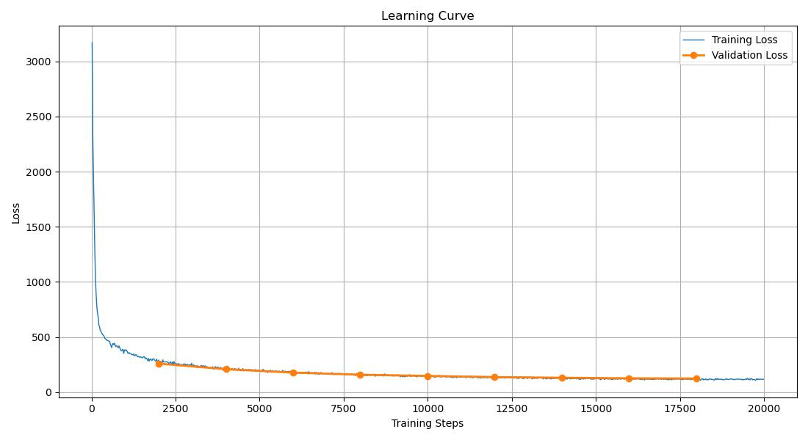
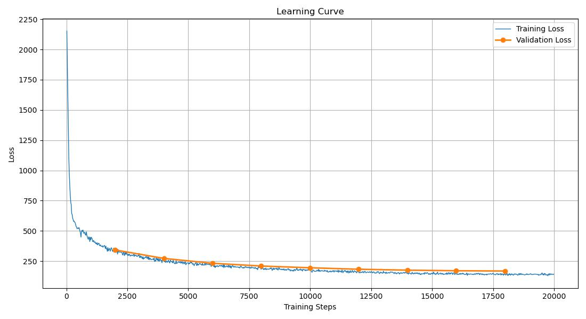

# BabyLM Knowledge Distillation

A knowledge distillation project for training small language models on the BabyLM dataset, transferring knowledge from a fine-tuned GPT-2 Large teacher model to a randomly initialized GPT-2 Small student model.

> **Project Period**: November 11 - December 2, 2025  
> **Status**: 
> - **Week 1 (Nov 11-18)**: Basic Distillation Pipeline & Baseline (10M dataset).
> - **Week 2 (Nov 19-25)**: MoE-P Architecture, RL (PPO) Pipeline & Evaluation.
> - **Week 3 (Nov 26 - Dec 2)**: **Scale to 100M Dataset**, Loss Visualization & Interactive Chatbot.

## 📊 Results

Our knowledge distillation approach achieves significant improvements over a randomly initialized baseline:

| Model | Loss | Perplexity (PPL) |
|-------|------|------------------|
| **Baseline** (Random Init + CE) | 3.777 | 43.69 |
| **Distilled Student** | 3.582 | 35.94 |
| **Improvement** | **-0.195** | **-7.75** (↓17.7%) |

The distilled student model shows a **17.7% reduction in perplexity** compared to the baseline, demonstrating the effectiveness of knowledge distillation.

## 🎯 Overview

This project implements a complete knowledge distillation pipeline:

1. **Teacher Model**: Fine-tune GPT-2 Large on BabyLM dataset
2. **Student Model**: Train a randomly initialized GPT-2 Small using knowledge distillation
3. **Baseline Comparison**: Train a randomly initialized GPT-2 Small with standard cross-entropy loss
4. **MoE-P Architecture**: Implement Mixture-of-Experts with Parallel Layers (MoE-P) as a student model
5. **Reinforcement Learning**: Implement PPO training with Llama-3 based reward model

### Architecture

- **Teacher**: GPT-2 Large (774M parameters)
- **Student**: GPT-2 Small (124M parameters)
- **MoE-P Student**: Custom architecture based on "Mixture-of-Experts with Parallel Layers"
- **RL Agent**: PPO-tuned model optimized for specific rewards
- **Distillation Method**: KL divergence loss + student cross-entropy loss
- **Temperature**: 2.0
- **Alpha**: 0.5 (weighting between distillation and student loss)

## 🚀 Quick Start

### Prerequisites

```bash
# Install dependencies
pip install -r requirements.txt
```

### Training Pipeline

#### Step 1: Prepare Data

**Option A: 10M Dataset** (Original)

```bash
python combine_babylm.py
```

This merges all `.train` files from `train_10M/` directory and splits into:
- Training set: `corpus_split/train_babylm.txt` (95%)
- Validation set: `corpus_split/val_babylm.txt` (5%)

**Option B: 100M Dataset** (Current)

Similarly process files from `train_100M/` directory:
- Training set: `corpus_split_100M/train_babylm.txt` (95%)
- Validation set: `corpus_split_100M/val_babylm.txt` (5%)

#### Step 2: Fine-tune Teacher Model

**Option A: Full Fine-tuning** (≥8GB GPU memory)

```bash
python 7_train_teachers.py --config gpt2-large-babylm.yaml
```

**Option B: LoRA/QLoRA Fine-tuning** (<8GB GPU memory)

```bash
python 7_train_teachers.py --config gpt2-large-babylm.yaml --use_lora
```

**Option C: QLoRA Fine-tuning** (<4GB GPU memory)

```bash
python 7_train_teachers.py --config gpt2-large-babylm.yaml --use_qlora
```


#### Step 3: Train Baseline Model (for comparison)

```bash
python train_gpt2_small_ce.py
```

This trains a randomly initialized GPT-2 Small using standard cross-entropy loss.

#### Step 4: Distill Student Model

```bash
python 8_train_student.py
```

This trains a randomly initialized GPT-2 Small using knowledge distillation from the teacher.

#### Step 5: Distill MoE-P Student Model

```bash
python train_moep_student.py
```

This trains a custom **MoE-P (Mixture-of-Experts with Parallel Layers)** student model using knowledge distillation. The configuration aligns with the MoEP paper (Table 2 & 3).

#### Step 6: Reinforcement Learning with PPO

```bash
python ppo.py
```

This runs the PPO training loop using:
- **Policy Model**: Your trained student model
- **Reward Model**: Llama-3.1-8B-Instruct (or Random for testing)
- **Dataset**: Interactive prompts (TinyStories, WritingPrompts, etc.)

#### Step 7: Visualize Training Loss

```bash
python visual.py
```

This generates loss curves from training checkpoints. Configure the model name and checkpoint directories in the script.

#### Step 8: Interactive Chatbot

We provide an interactive chatbot interface on **Hugging Face** for testing trained models. Visit our [LMseed repository](https://huggingface.co/LMseed) to try the chatbot and interact with our trained models.

### Evaluation Pipeline

We support the official BabyLM zero-shot evaluation suite (BLiMP, EWoK, etc.).

**Run Zero-shot Evaluation:**

```bash
cd eval
# Usage: ./eval_zero_shot.sh <Model Path> <Backend> [Data Path]
# Note: Use absolute path for the model
./eval_zero_shot.sh /absolute/path/to/models/MoEP-Student-Distilled-PaperCfg causal
```

**Note:** For custom models like MoE-P, we have modified `run.py` to automatically register the model architecture.


## 📁 Project Structure

```
BabyLM/
├── train_10M/                    # BabyLM training data (10M)
│   ├── bnc_spoken.train
│   ├── childes.train
│   ├── gutenberg.train
│   ├── open_subtitles.train
│   ├── simple_wiki.train
│   └── switchboard.train
├── train_100M/                   # BabyLM training data (100M)
│   └── ...
├── corpus_split/                  # Processed data (10M)
│   ├── train_babylm.txt
│   └── val_babylm.txt
├── corpus_split_100M/             # Processed data (100M)
│   ├── train_babylm.txt
│   └── val_babylm.txt
├── models/                        # Trained models
│   ├── GPT2-Large-BabyLM/         # Fine-tuned teacher
│   ├── GPT2-Small-BabyLM-CE/      # Baseline student
│   ├── GPT2-Small-Distilled/      # Distilled student (10M)
│   ├── GPT2-Small-Distilled-100M/ # Distilled student (100M)
│   ├── GPT2-Small-Distilled-RL/   # RL-tuned student (PPO)
│   ├── MoEP-Student-Distilled/    # MoE-P student (Initial)
│   └── MoEP-Student-Distilled-PaperCfg/ # MoE-P student (Paper Config)
├── eval/                          # Evaluation suite
│   ├── eval_zero_shot.sh          # Evaluation script
│   └── ...
├── interactive/                   # RL / Interactive components
│   ├── ppotrainer.py              # Custom PPO Trainer
│   ├── reward.py                  # Reward models (Llama-3, Random)
│   └── ...
├── combine_babylm.py              # Data preparation
├── 7_train_teachers.py            # Teacher fine-tuning (full/LoRA/QLoRA)
├── train_gpt2_small_ce.py        # Baseline student training
├── 8_train_student.py             # Student distillation
├── train_moep_student.py          # MoE-P student distillation
├── modeling_moep.py               # MoE-P model definition
├── ppo.py                         # PPO training entry point
├── visual.py                      # Loss curve visualization
├── custom_dataset.py              # PyTorch dataset class
├── gpt2-large-babylm.yaml        # Training configuration
├── GPT2-Small-Distilled-100M.jpg # Loss curve (100M training)
├── GPT2-Small-Distilled-100M-dft.jpg # Loss curve (100M distillation)
└── README.md
```

## ⚙️ Configuration

### Teacher Model Configuration (`gpt2-large-babylm.yaml`)

```yaml
data:
  train_path: "./corpus_split/train_babylm.txt"
  eval_path: "./corpus_split/val_babylm.txt"
  seq_length: 128
  eval_samples: 8192

model:
  type: "GPT2"
  name: "GPT2-Large-BabyLM"
  use_pretrained: true
  pretrained_model: "gpt2-large"
  use_lora: false      # Set to true for LoRA
  use_qlora: false     # Set to true for QLoRA

training:
  lr: 2.5e-4
  batch_size: 128
  num_epochs: 4
  gradient_accumulation_steps: 16
  warmup_steps: 300
  fp16: True
```

### Student Model Configuration

**Baseline** (`train_gpt2_small_ce.py`):
- Learning rate: 2.5e-4
- Batch size: 32
- Epochs: 6
- Loss: Cross-entropy only

**Distilled** (`8_train_student.py`):
- Learning rate: 2.5e-4
- Batch size: 32
- Epochs: 6
- Temperature: 2.0
- Alpha: 0.5 (distillation loss weight)
- Loss: KL divergence + cross-entropy

### MoE-P Student Configuration (`train_moep_student.py`)

Based on the MoEP paper (Table 2 & 3):

- **Dimensions**: `dim=384`, `n_heads=6`, `n_layers=12`
- **MoE Params**: `n_experts=4`, `top_k=2`
- **Parallel Layers**: `parallel_dim=192`, `parallel_n_heads=3`
- **Training**: `lr=3e-4`, `batch_size=16`, `seq_len=512`

### RL Configuration (`config/ppo.yaml`)

- **Algorithm**: PPO (Proximal Policy Optimization)
- **Library**: `trl` (Transformer Reinforcement Learning)
- **Reward Model**: Llama-3.1-8B-Instruct (via `interactive.reward`)
- **Environment**: Interactive text generation

## 🔬 Methodology

### Knowledge Distillation

The student model learns from the teacher's soft labels (logits) using:

```
Loss = α × L_CE(student) + (1-α) × L_KL(student, teacher)
```

Where:
- `L_CE`: Cross-entropy loss on ground truth labels
- `L_KL`: KL divergence between student and teacher logits (softened by temperature)
- `α = 0.5`: Weighting factor
- `Temperature = 2.0`: Softens the teacher's probability distribution

### Tokenizer

We use GPT-2's original tokenizer (50,257 vocabulary) for full compatibility with pre-trained models. This ensures:
- Perfect compatibility with GPT-2 pre-trained weights
- No vocabulary mapping needed
- Stable training

### Checkpointing Strategy

The student model training (`8_train_student.py`) uses a data-volume based checkpointing strategy instead of epoch-based saving. This allows for analyzing model performance at specific training milestones:

- **1M - 10M words**: Checkpoint every 1M words
- **20M - 100M words**: Checkpoint every 10M words
- **200M - 1000M words**: Checkpoint every 100M words

Checkpoints are saved in `models/GPT2-Small-Distilled/` (or `models/GPT2-Small-Distilled-100M/` for 100M dataset) and are **not** automatically deleted, so ensure sufficient disk space is available.

## 📊 Visualization & Analysis

### Loss Curve Visualization

We provide a visualization tool (`visual.py`) to plot training and validation loss curves from model checkpoints:

```bash
python visual.py
```

**Configuration**: Edit `visual.py` to specify:
- `model_name`: Name of the model directory (e.g., `"GPT2-Small-Distilled-100M"`)
- `model_dir`: Path to model directory (e.g., `Path("models") / Path(model_name)`)
- `checkpoint_dirs`: List of checkpoint directories to analyze

**Output**: Generates a loss curve plot saved as `{model_name}.jpg`

### Training Results (100M Dataset)

Below are the loss curves for our GPT2-Small student model trained on the 100M BabyLM dataset:





### Interactive Chatbot

We provide an **interactive chatbot interface** on Hugging Face for testing our trained models. The chatbot allows you to:
- Chat with distilled student models
- Test MoE-P architecture models
- Experiment with RL-tuned models
- Adjust generation parameters (temperature, top-k, top-p)

**Try it now**: Visit our [LMseed Hugging Face Space](https://huggingface.co/LMseed) to interact with our trained models!

## 📈 Training Details

### Teacher Model
- **Base Model**: GPT-2 Large (pre-trained)
- **Fine-tuning**: Full fine-tuning or LoRA/QLoRA on BabyLM dataset
- **Output**: `models/GPT2-Large-BabyLM/`

### Baseline Student
- **Architecture**: GPT-2 Small (random initialization)
- **Training**: Standard cross-entropy loss
- **Output**: `models/GPT2-Small-BabyLM-CE/`

### Distilled Student
- **Architecture**: GPT-2 Small (random initialization)
- **Training**: Knowledge distillation from teacher
- **Checkpointing**: Saved at specific word-count milestones (1M, 2M... 10M, 20M... 100M, etc.)
- **Output**: `models/GPT2-Small-Distilled/`

### Teacher moModel for Reinforcement Learning
- **Base Model**: Llama-3.1-8B-Instruct

## 🖥️ System Requirements

### GPU Memory Recommendations
- **Full Fine-tuning**: ≥8GB (e.g., RTX 3070, A100)
- **LoRA**: 4-8GB (e.g., RTX 3060)
- **QLoRA**: <4GB (e.g., RTX 2060)

### Example SLURM Commands

```bash
# Query available GPUs 
sinfo | grep gpu

# Cancel job
scancel <job_id>

# Cancel all jobs
scancel -u username

# Check job status
squeue -u username  

# Request GPU
salloc -p gpua100 -t 4:00:00 --gres=gpu:1

# Enter interactive session
srun --pty bash

# Load modules
module load GCCcore/12.2.0
module load Python/3.10.8

# Activate environment
source ~/BabyLM/babylm/bin/activate
```

## 📝 Key Files

- `combine_babylm.py`: Merges and splits BabyLM data files while maintaining sentence coherence
- `7_train_teachers.py`: Teacher fine-tuning (supports full, LoRA, and QLoRA)
- `train_gpt2_small_ce.py`: Baseline student training (cross-entropy only)
- `8_train_student.py`: Student distillation training
- `custom_dataset.py`: PyTorch dataset for text data with caching support

## ⚠️ Notes

1. **LoRA/QLoRA**: When using parameter-efficient fine-tuning, only adapter weights are saved. For inference, load the base model + adapter.

2. **QLoRA Dependency**: Requires `bitsandbytes` package for 4-bit quantization.

3. **Memory Optimization**: If running out of memory, reduce `batch_size` and increase `gradient_accumulation_steps`.

4. **Tokenizer Consistency**: All models use the same GPT-2 tokenizer for consistency.

5. **Data Coherence**: The `combine_babylm.py` script maintains sentence order within each file to preserve dialogue and text coherence.


## 📅 Implementation Status

### Week 1 (Nov 11-18, 2025)

This is our initial implementation completed during Week 1 (November 11-18, 2024). The current version includes:

### Completed
- Basic knowledge distillation pipeline
- Teacher model fine-tuning (full and LoRA/QLoRA)
- Student model training with distillation
- Baseline comparison model
- Data preparation with coherence preservation

### Notes
- Results are preliminary and subject to change
- Configuration parameters may be adjusted in future iterations
- Evaluation metrics and methodology may be refined

### Week 2 (Nov 19-25, 2025)

- **MoE-P Architecture**: Implemented `modeling_moep.py` with parallel layers and router.
- **MoE-P Distillation**: Created `train_moep_student.py` to distill knowledge into MoE-P.
- **Reinforcement Learning**: Implemented `ppo.py` and `interactive/` module for RLHF training.
- **Evaluation Pipeline**: Integrated official BabyLM evaluation suite with support for custom MoE-P models.
- **Paper Alignment**: Aligned MoE-P hyperparameters with the original paper.

### Week 3 (Nov 26 - Dec 2, 2025)

- **100M Dataset**: Scaled training to 100M BabyLM dataset for improved model performance.
- **Loss Visualization**: Implemented `visual.py` to generate training and validation loss curves from checkpoints.
- **Interactive Chatbot**: Deployed interactive chatbot interface on Hugging Face/LMseed for model testing.
- **Training Results**: Generated and documented loss curves for 100M dataset training.

## 🔗 References

- [BabyLM Challenge](https://babylm.github.io/)
- [Hugging Face Transformers](https://huggingface.co/docs/transformers)
- [Knowledge Distillation Paper](https://arxiv.org/abs/1503.02531)
